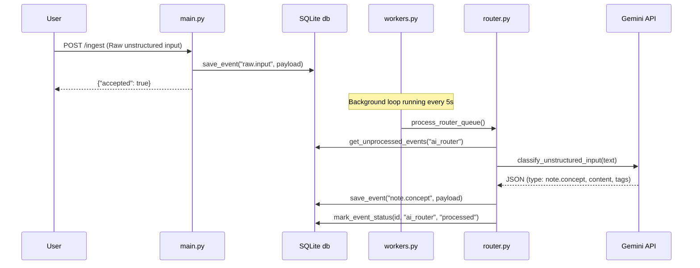

# COGNITUM Architecture Specification

This document details the architectural layout, data pipelines, and design principles of the COGNITUM Cognition Layer.

---

## 1. System Topology

COGNITUM sits as a modular "Cognition Layer" between client interfaces (such as Telegram or HTTP webhooks) and target host execution environments. It maps inputs, maintains state, applies safety gate checks, queries memory vectors, and plans actions.

```mermaid
graph TD
    subgraph Client Interfaces
        TG[Telegram Bot]
        API_Client[HOMES Hub API / HTTP Gateways]
    end

    subgraph API Router Layer
        Main[cognitum/main.py]
        API_Plan[/plan]
        API_Context[/context]
        API_Policy[/policy]
        API_Memory[/memory]
    end

    subgraph Core Services
        Planner[core/planner.py]
        PolicyGate[core/policy_gate.py]
        ProfileStore[core/profile_store.py]
        MemoryStore[core/memory_store.py]
        StateDB[(SQLite state.db)]
    end

    subgraph Memory Vault
        Obsidian[Obsidian Vault Markdown]
    end

    TG -->|Ingest / Chat| Main
    API_Client -->|Webhook / API Calls| Main
    Main --> API_Plan
    Main --> API_Context
    Main --> API_Policy
    Main --> API_Memory

    API_Plan --> Planner
    API_Context --> ProfileStore
    API_Context --> PolicyGate
    API_Context --> MemoryStore
    API_Memory --> MemoryStore

    MemoryStore --> StateDB
    MemoryStore --> Obsidian
    Planner -->|Model Call| Gemini[Gemini 2.5 Flash]
```

---

## 2. Component Directory Breakdown

### 2.1 API Layer (`cognitum/api/`)
* **`/plan`**: Receives an execution request or goal. Coordinates with Profile, Policy, and Memory to generate a structured, schema-validated step sequence via Gemini.
* **`/context`**: Compiles an active snapshot of the system (active profile, policy parameters, host CPU/RAM metrics, and query-relevant memories).
* **`/policy`**: Provides endpoints to view safety configurations and evaluate arbitrary shell actions or commands against the policy gate.
* **`/profile`**: Exposes configuration controls to read and save user details, timezones, and active goals.
* **`/memory`**: Supports ad-hoc memory search and factual context logging.

### 2.2 Core Layer (`cognitum/core/`)
* **`planner.py`**: Manages communication with the Gemini SDK (`google-genai`). Implements retry logics with exponential backoff on `RESOURCE_EXHAUSTED` (429) errors. Uses Pydantic schemas to enforce structured JSON outputs for action plans.
* **`policy_gate.py`**: Evaluates execution safety. Rejects commands targeting sensitive directories, bans root-level actions (`sudo`), containment boundaries, and alerts operations if executed during quiet hours.
* **`profile_store.py`**: Reads/writes user-specific options to structured YAML files (`profiles/default.yaml`).
* **`memory_store.py`**: Manages data retrieval. Searches both database tables (SQLite transaction logs) and text records (Obsidian Markdown files) using substring matching.

---

## 3. Operations Data Flow

### 3.1 Event Ingestion & Classification Pipeline



---

## 4. Safety Policy Evaluation Flow

Safety is checked deterministically in `policy_gate.py` before any action is approved for planner recommendation or system execution:

```
[Requested Action]
       │
       ▼
[Quiet Hours Active?] ── Yes ──► [Is executing or writing?] ── Yes ──► [Deny Action]
       │                                                          │
      No                                                         No
       │                                                          │
       ▼                                                          ▼
[Command Safety Check] ── sudo command? ── Yes ──► [Deny Action]
       │
      No
       │
       ▼
[Contains forbidden word?] (rm -rf, dd, passwd, etc.) ── Yes ──► [Deny Action]
       │
      No
       │
       ▼
[Path Containment?] ── writing outside workspace? ── Yes ──► [Deny Action]
       │
      No
       │
       ▼
[Approve Action]
```
